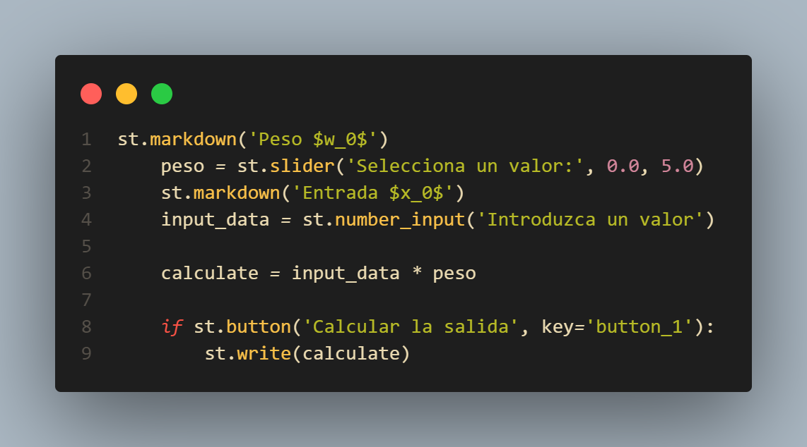
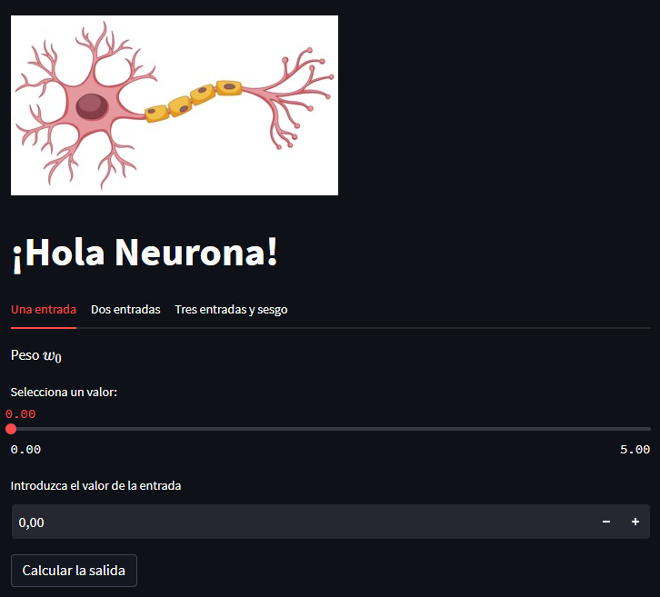
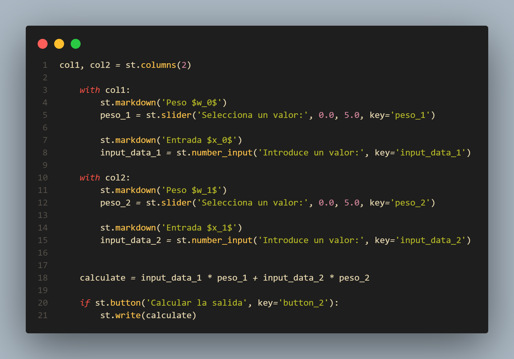
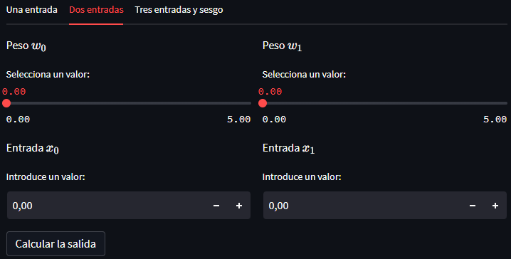
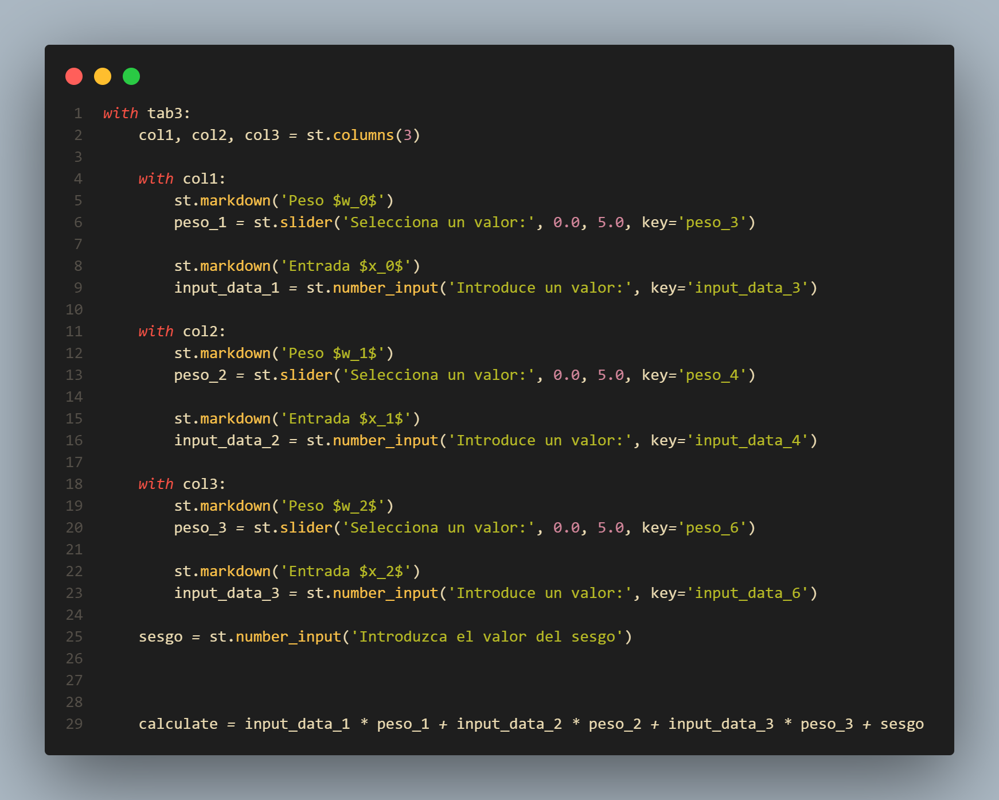
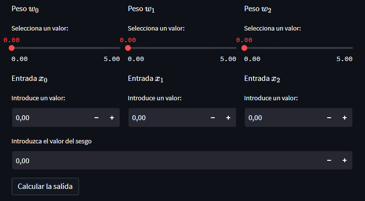

# Hola Neurona

## Concepto
Este *mini-proyecto* es útil para comprender el funcionamiento básico de una neurona artificial, mas conocida como Perceptrón.

## Aplicación

Puedes probar la aplicación en el siguiente enlace: 

### Tecnologías usadas:

### Uso de la aplicación:

#### Para una entrada:

El funcionamiento de un perceptrón es simple de comprender, en este caso nuestro programa coge unos parametros de entrada que son:

Un input, representada como **$x_0$**  

Un peso, representada como **$w_0$**

El peso lo que nos permite es darle mas relevancia o importancia a **$x_0$**

**$y$** devuelve una salida donde se a realizado el siguiente calculo:

$$y = x * w_0$$

En el código se ve de la siguiente forma:

En la aplicación se veria así:

#### Para dos entradas:

Para dos entradas se realiza lo mismo pero haciendo el sumatorio de todos los calculos entre las entradas y los pesos, la formula es la siguiente:

$$y = f(\sum_{i=1}^nx_nw_n)$$

En este caso **$y$** se implementaria así:

$$y = x_0 * w_0 + x_1 * w_1 $$

En el código se ve de la siguiente forma:

En la aplicación se veria así:

#### Para tres entradas:

Para tres entradas se realiza lo mismo que en el de dos entradas, pero esta vez le hemos añadido el sesgo o bias en ingles:

$$y = f(\sum_{i=1}^nx_nw_n+b)$$

En este caso **$y$** se implementaria así:

$$y = x_0 * w_0 + x_1 * w_1  + b$$

En el código se ve de la siguiente forma:

En la aplicación se veria así:

